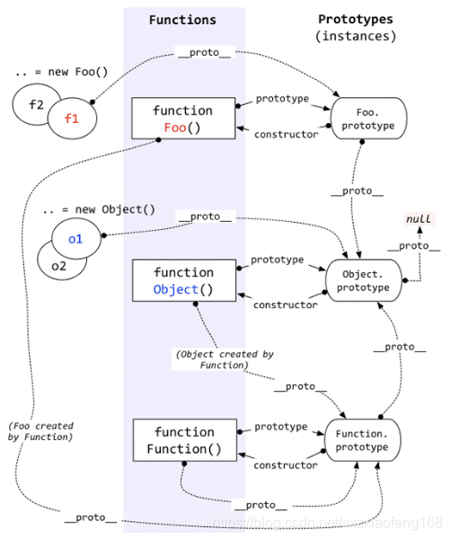
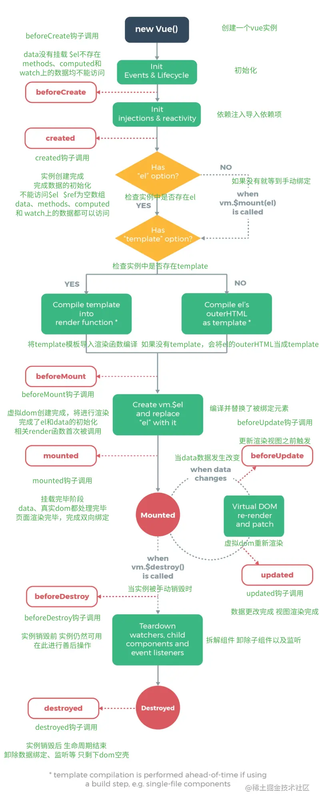

###	1. 数据类型

* 判断数据类型的方法：typeof、instanceof、Object.prototype.toString.call( )、isArray
* typeof: 可以区分Number、String、Boolean、Undefined、Function; 不能区分普通对象、数组、null
  * typeof [ ]  => object、typeof null => object（检测不了null, 是javascript设计上的缺陷）
* instanceof: 专门用检测对象的数据类型，Object、Array、Function
  * A instanceof B: 检测A是否是B的实例对象
* Object.prototype.toString.call( ), 通用的数据类型检测方法，可以检测所有类型

### 2. 数组方法

- ##### 2.1 会改变原数组的方法：splice、pop、push、shift、unshift（数组头部插入）、reverse、sort

- ##### 2.2 数组去重的方法

  ```js
  function unique1(arr){
     const newArr = [];
     arr.forEach(item => {
         if(newArr.indexOf(item) === -1){
             newArr.push(item);
         }
     })
      return newArr;
  }
  
  function unique2(arr){
      return arr.filter((item,index) => index === arr.indexOf(item));
  }
  
  function unique3(arr){
      return [...new Set(arr)];
  }
  
  // 利用对象属性名不能重复去重
  function unique4(arr){
      const obj = {};
      arr.forEach((item) =>{
            // 把数组的每一项作为对象的key
              obj[item] = 0;
          });
       //对象的键名不能重复,重复会被覆盖
      const newArr = [];
      for(const key in obj){
          //对象的键名是字符串,用+转换成number类型
          newArr.push(+key);
      }
      return newArr;
  }
  ```

- ##### 2.3 伪数组的特点？伪数组有哪些？伪数组转换成真数组？

  * 伪数组的特点
    * 伪数组是对象，是以键值对的形式存储数据的
    * 伪数组并不是真的数组，没有数组的方法
    * 伪数组有length属性
  * 伪数组有以下几种：
    * DOM选择器选择的节点列表
    * arguments对象
    * juquery选择器选择的元素
  * 伪数组转换成真数组
    * Aarray.prototype.slice.call(arguments)、[ ].slice.call(arguments)
    * Array.from(arguments)

### 3. 字符串方法

* charAt()、trim()、toLowercase()、toUppercase()、substr()、substring()、valueof()、toString()、concat()、indexOf()、lastIndexOf()、includes()、repeat()、slice()、split()、match()、replace().（具体用法查阅[MDN文档](https://developer.mozilla.org/zh-CN/docs/Web/JavaScript/Reference/Global_Objects/String)）

* substr、substring、slice区别

  ```js
  相同点：都接收两个参数，slice和substring接收的是起始位置和结束位置(不包括结束位置)
  不同点：substr接收的第一个参数是起始位置，第二个参数是返回字符串长度
  注意：
  1. substring是以两个参数中较小一个作为起始位置，较大的参数作为结束位置；
  2. 	当接收的参数是负数时，slice会将它字符串的长度与对应的负数相加，结果作为参数；
  	substr则仅仅是将第一个参数与字符串长度相加后的结果作为第一个参数；
  	substring则将负参数都直接转换为0
  
  // slice和substring接收的是起始位置和结束位置(不包括结束位置)
  let str = 'hello world!'
  console.log(str.slice(2,5)) // 'llo' 不包含空格
  console.log(str.substring(2,5)) // 'llo' 不包含空格
  
  // substr接收的第一个参数是起始位置，第二个参数是返回字符串长度
  let str = 'hello world!'
  console.log(str.substr(2,5)) // 'llo w'，第二个参数5表示返回长度为5的字符串
  
  // substring是以两个参数中较小一个作为起始位置，较大的参数作为结束位置；
  let str = 'hello world!'
  console.log(str.slice(5,2)) // ''空字符串
  console.log(str.substring(5,2)) // 'llo' 参数调换位置，结果不变和之前一样
  
  // 当接收的参数是负数时，slice会将它字符串的长度与对应的负数相加，结果作为参数；
  let str = 'hello world!' // length: 12
  console.log(str.slice(5, -2)) // ' worl'
  
  // substr则仅仅是将第一个参数与字符串长度相加后的结果作为第一个参数；如果第二参数为负数，那结果必然为空字符串（第二个参数表示截取长度）
  let str = 'hello world!' // length: 12
  console.log(str.substr(-5, 2)) // 'or'
  
  // substring则将负参数都直接转换为0
  let str = 'hello world!' // length: 12
  console.log(str.substring(-5, 2)) 'he'
  ```

### 4. Number类型

* 判断一个变量是不是NaN，可以用===全等判断是否和自身相等，只有NaN不和自身全等
* isNaN, 判断你传的参数是否可以转换成一个数字，返回false, 则可以转换成一个数字

###	5. Boolean类型

* undefined、null、0(-0)、NaN、‘ ’、false, 这个6个值转Boolean类型为false, 除此之外，转布尔类型都是true
* 任何对象转布尔类型都是true, 如：Boolean(new Boolean(false))  => true
* 快速将任何数据类型转为布尔类型，可以使用 !! 两次取反
* 使用new操作符创建实例对象，如果（）里没有参数，括号可以省略

### 4. javaScript继承

* 原型链继承

  ```js
  // 有A、B两个构造函数
  function A() {}
  function B() {}
  B.prototype = new A(); // B继承A，B的原型指向A的实例，B是子类，A是父类
  
  缺点：只能继承原型对象上的属性，所有属性共享，只要其中改变一个，相关继承的属性也会改变，并且不能实现多继承，对于之类来讲，只有一个父类
  ```

  

* 构造函数继承

  ```js
  // 有A、B两个构造函数
  function A() {}
  function B() {
    // 在B构造函数当中，把所有A构造函数的代码运行一遍
    // 将A的this指向B的实例对象，为了得到父类A的属性
   	A.apply(this,arguments); // 括号内this是B构造函数的实例
  }
  
  缺点：只能继承构造函数中的属性，不能继承原型对象上的属性（可以实现多继承），所有属性（包括继承的）都是相互独立的，比较占内存
  ```

  

* 组合继承

  ```js
  // 有A、B两个构造函数
  function A() {}
  function B() {
   	A.apply(this,arguments); // 括号内this是B构造函数的实例
  }
  B.prototype = new A();
  // B的原型指向了A的实例，constructor指向会错误，要重新修正constructor指向
  B.prototype.constructor = B;
  
  缺点： 1.父类构造函数被执行了两次，子类prototype指向父类实例时执行了一次，子类调用父类又执行一次。如果父类构造函数比较复杂，
        运行时间就会较长
        2.相同属性在子类实例存在一份，在父类原型对象又存在一份。但并不影响使用，在你调用时会同名屏蔽，先在自身找，
        找到了就不会向上找
  ```

<!--  -->
<!--  -->


* 所有对象都有`__proto__`，指向构造函数的显示原型（prototype）
* 所有函数都有`prototype`，也叫原型对象
  * 原型对象有两个属性：一个constructor指向函数本身，一个`__proto__`指向`Object.prototype`，`Object.prototype.__proto__ === null`（原型链的终点）
* 所有函数都是`new Function()`产生的，包括`Function`本身

### 5. defer和async属性

* defer属性： 延迟执行，会同时并行加载多个js文件，依次执行（按照顺序，从上到下执行），会在js加载完成之后，等到整个文档解析完成之后执行
* async属性：异步加载，会并行加载多个js文件，但js文件下载完后会立即执行，不会按书写顺序执行，在外部js文件加载完成之后，如果浏览器空闲，并且lo ad事件触发，会在触发之前执行

### 6. Promise

* Promise主要是为了解决回调函数嵌套回调函数（地狱回调）的问题
* promise有三种状态pending（等待态）、resolve（成功态）、reject（失败态）
* *只有在pending状态的时候才能改变状态, 不能从成功变成失败, 也不能从失败变成成功*
* *成功有成功的原因, 失败同样也有失败的原因, 除了调用resolve和reject能改变状态外, 还可以使用throw new Error()抛出异常也会执行到失败的逻辑*
* *如果返回的是一个失败的promise或者 throw new Error(报错了), 才会走到下一个then的失败, 否则全部走成功*
* Promise.all([ ]), 等到所有的promise执行完，才会继续执行后面的代码，参数是一个数组，数组里是promise对象
* Promise.all和Promise.race的区别
  * all数组中所有的promise，全部决议完成之后，这时会把所有的决议值以数组的形式传入到你的回调里面，但对于race来讲，你传进去的数组有多少个promise决议，它会把所有promise当中，第一个决议值传入到回调里面
* then、catch的返回值是一个新的promise实例，因此promise可以进行链式调用
* promise的异常捕获和try...catch区别
  * try...catch是尝试你后面的代码能否正常运行，是一种异常捕获机制。对promise来讲，它里面有两个状态，一个resolve、一个reject状态，只要发生异常或者错误，promise就会进入reject决议，然后进入catch里面进行处理，对于try...catch来讲，它是先调用try执行里面的代码，如果报错了，再进入到catch里面，然后把错误传入到catch里面进行处理。try...catch不能捕获异步下的异常，比如我要发送一个ajax请求，没有办法使用try...catch捕获ajax里面的异常，只能在ajax的回调里面进行try...catch或者整体再包一层try...catch, 这样就很麻烦。对于promise来讲，可以捕获异步的异常

### 7. ES6新增语法

* import、export，导入和导出（模块化）
* 数组、对象解构赋值
* let、const的使用，const用来定义常量
* class、extend的使用，类和继承的概念
* 箭头函数、函数传参默认值、rest参数（...), 用于获取函数多余参数，其值为一个数组
* 模板字符串，可以直接在里面写html标签，也可以使用${}来引用变量
  * 箭头函数和普通函数的区别
     1. 箭头函数没有prototype，所以箭头函数没有this
     2. 箭头函数的this在定义的时候继承自离它最近的外层函数，包括arguments
    3. 如果箭头函数外层没有普通函数，严格模式和非严格模式下它this都会指向window
     4. new调用箭头函数会报错，因为箭头函数没有constructor

### 8. js的事件

* 事件的实现
  1. 直接嵌入dom，写在标签内
  2. 直接绑定，先获取dom节点（DOM0级事件）
  3. 事件的监听和卸载，addEventListener和removeEventListener、IE是attachEvent和detachEvent
* 事件委托：给最外层的父级元素绑定事件
* 事件流：捕获阶段、目标阶段、冒泡阶段（从window开始再回到window的过程）
* 对于同一个DOM元素，即在捕获阶段，又在目标阶段、冒泡阶段同时绑定事件，那当事件被触发，整体的执行顺序决定于你书写的顺序
* stopPropagation、preventDefault，阻止冒泡和阻止默认行为
* target和currentTarget，target属性指向的是目标DOM节点，currentTarget属性指向的是当前对象的DOM节点

### 9. 网络请求相关

* 1开头（信息类）：表示信息响应的请求，接收到请求，可以进行后续的处理
* 2开头（响应成功）：表示动作被成功接收。如：200表示请求成功
* 3开头（重定向类）：表示服务器重定向响应，为了完成某些特别的指令。如：304表示重定向，让浏览器取去缓存读取资源
* 4开头（客户端错误类）：表示客户端错误，请求包含错误语法或不能正确执行。如：404表示找不到资源，403表示禁止访问，服务器收到请求，但是拒绝提供服务
* 5开头（服务端错误类）：表示服务器错误，服务器不能正确执行一个正确的请求。如：500表示服务器遇到错误，无法完成请求，503表示超载或停机维护
* http和https区别
  1. http是超文本传输协议，信息是明文传输，https则是具有安全性的ssl加密传输协议。
  2. http和https使用的是完全不同的连接方式，用的端口也不一样，前者是80，后者是443。
  3. http的连接很简单，是无状态的；HTTPS协议是由SSL+HTTP协议构建的可进行加密传输、身份认证的网络协议，比http协议安全。
* 输入url到页面加载的整个流程
  1. DNS域名解析（本质是找域名对应的ip地址）
       如果你之前访问过该网站，那么域名和IP地址的映射关系会被缓存下来，查找信息的顺序依次是：浏览器DNS缓存 -> 计算机DNS缓存 -> 路由器DNS缓存 -> 网络运营商DNS缓存 -> 根服务器。查找到对应的ip地址后，就会建立TCP连接
    2. TCP连接，三次握手
       * 第一次握手：浏览器发送给服务器，告诉服务器我准备好了，将要发送请求（会带上syn码）
       * 第二次握手：服务器发送给浏览器，告诉浏览器我也准备好了，需要和你再次确认（带上syn+ack码）
       * 第三次握手：浏览器发送给服务器，告诉服务器确认完毕，马上发送请求
       * 三次握手目的：确保双方都准备充分，不会断开连接。防止失效连接请求报文突然又传送到服务器，产生错误
    3. 发送请求（发送请求报文到服务器）
    4. 返回响应（服务器将响应报文发送到浏览器）
    5. 页面渲染
       * a. http解析器解析html成dom树
       * b. css解析器解析css，解析成cssom树
       * c. 调用js解析器解析js代码，如果修改了dom节点，就会重新解析成dom树；如果修改了css节点，就会重新解析成cssom树
       * d. 将dom树和cssom树，合并成render树
       * e. 布局，render渲染
    6. 断开连接，TCP四次挥手
       * 第一次挥手：浏览器发送给服务器，告诉服务器请求报文发送完毕
       * 第二次挥手：服务器发送给浏览器，告诉浏览器请求报文接收完毕，可以等待断开
       * 第三次挥手：服务器发送给浏览器，告诉浏览器响应报文发送完毕
       * 第四次挥手：浏览器发送给服务器，告诉服务器响应报文接收完毕了，可以断开连接（先是服务器断开连接）

### 10. 跨域

* 跨域的原因主要是违反了浏览器的同源策略，同源是指同协议、同域名、同端口
* 解决跨域问题主要有以下方法：
  * jsonp：主要是利用js动态创建script标签向服务器发送get请求（script标签不支持post请求），服务器收到请求后将数据放在一个指定名字的回调函数中并传送回来
  * cros：本质就是使用自定义的http头部（Access-Control-Allow-Origin）让浏览器与服务器进行沟通，从而决定请求或响应应该成功或失败
  * H5新的api：postMessage、webSocket（在线客服在线聊天）可以实现双向通信（socket.io.js库）
  * Nginx配置反向代理，配置一个代理服务器来做跳板。同源策略只是浏览器的一个安全策略，并不是http协议的一部分，所以如果在服务器端调用接口，走的是http协议，不存在浏览器跨域

### 11. get与post区别

* get请求会被浏览器主动缓存，而post不会。除非手动设置
* get请求只能进行url编码，而post支持多种编码方式
* get请求参数会被完整保留在浏览器历史记录里，而post请求中的参数不回被保留
* get请求在url中传递的参数是有长度限制的（2k），而post没有
* 对于参数的数据类型，get请求只接受ASCII字符，而post没有限制
* get请求更不安全，因为参数直接暴露在url上，所以不能用来传递敏感信息
* get请求参数通过url传递，post请求参数放在请求体中

### 12. mvvm和mvc的区别

* mvvm和mvc是两种不同的架构模式，设计思想。mvc分别表示model（数据）、view（视图）、controller（控制器），view是指用户看到的视图界面，model是指本地数据和数据库中的数据，基本来说我们的产品都是通过获取数据、处理数据后进行视图渲染，也可以获取视图中用户输入的数据，然后通过接口写入到数据库中，传统的mvc架构是通过控制更新模型，视图从模型中获取数据进行渲染，当用户有输入时，通过控制器更新模型，再通知视图进行更新。这样控制器就承担了更多的责任，当我们项目日渐成熟复杂时，控制器中的代码就会越来越臃肿，不利于后期维护。在mvvm架构中，引入了viewmodel的思想，viewmodel是view和model的连接，viewmodel只在乎数据和业务的处理，不在乎view如何处理数据，那么这种情况下就可以将view和model单独分离出来，一方的改变并不一定会改变另一方，并且可以将可复用逻辑放入viewmodel中，可以多个view复用这个viewmodel。

### 13. 计算属性和watch区别

* 计算属性概念：模板显示要显示的数据是根据n个已有的相关数据进行计算来确定的
* getter：get方法，当读取属性值时，相关数据发生了改变自动调用。根据相关数据进行计算并返回结果
* setter：set方法，当修改了当前属性的值自动调用，监视属性值的变化去更新相关数据
* watch：监听到值的变化就会执行回调，在回调中可以进行一些相关逻辑操作。
* 区别：一般来说，需要依赖别的属性来动态获取值的时候可以使用computed，对于监听到值的变化需要做一些复杂业务逻辑的情况，可以使用watch（异步操作或属性值频繁变化）

### 14. vue组件的生命周期

* vue组件的生命周期是指vue组件从产生到销毁的过程，首先是new Vue()创建一个vue的实例，然后调用init函数对组件进行初始化。它会初始化生命周期函数和默认事件，接着会来到beforeCreate生命周期函数阶段，在beforeCreate生命周期函数执行的时候，data和methods中的数据还没有被初始化；在created中，data和methods都已经初始化好了，如果要调用methods中的方法，或者操作data中的数据，最早只能在created中操作；beforemount钩子执行的时候，模板已经在内存中编译好了，但是尚未挂载到页面中去，此时，页面还是旧的；mounted钩子执行完，表示整个vue实例已经初始化完毕了，此时，组件已经脱离了创建阶段，进入到运行阶段；beforeUpdate钩子执行的时候，页面中显示的数据还是旧的，此时data中数据是最新的，页面尚未和最新的数据保持同步；updated钩子执行的时候，页面和data中的数据保持同步了，都是最新的；beforeDestory钩子执行的时候，vue实例已经从运行阶段进入销毁阶段，实例上所有data数据和methods中的方法，都处于可用的状态。此时，还没有真正执行销毁的过程；destoryed钩子执行的时候，组件被完全销毁了，此时，组件中所有的数据和方法、指令都已经不可用了

  <!--  -->
  <!--  -->
  

### 15. vue组件通信

1. props: 父子组件通信的基本方式
     * 属性值的两大类型：
       * 一般普通值：父传子
       * 回调函数：子传父，父组件传回调函数给子组件，子组件调用。（子传父现在常用的是$emit，在父组件自定义事件，子组件$emit派发这个自定义事件）
     * 缺点：隔层组件传递，必须逐层传递，很麻烦；兄弟组件间传递，必须借助父组件，也很麻烦
  2. 自定义事件（$emit）
     * 子传父：用来取代父组件传回调给子组件的形式，父组件自定义事件，子组件$emit派发这个自定义事件
     * 缺点：不适合隔层组件和兄弟组件间的通信
  3. 消息发布和订阅（pubSub插件）
     * 适合任何组件间的通信
     * 缺点：管理不够集中
  4. vuex：集中式状态管理
     * state模块：存放状态数据，vuex使用单一状态树，即用一个对象就包含了全部的状态数据，state作为构造器选项，定义了所有我们需要的基本状态参数
     * getters：存放状态数据计算属性的getter方法
     * actions：用来提交mutation，存放的是修改状态数据的异步方法
     * mutations：存放的是修改状态数据的同步方法
  5. slot插槽
     * 通信是带数据的标签（标签实在父组件中解析）
  6. provide、inject
     * 在父组件通过provide将方法、属性或者是自身实例暴露出去，后代组件通过inject把父辈组件provide引进来，提供给自己使用。比较经典的应用场景是element-ui中el-form和el-form-item
     * 优点：组件通信不受子组件层级的影响，更适合深层次的复杂父子代组件通信，子组件可以共享父组件的状态
     * 缺点：不适合兄弟组件通信，数据流向一直都是由父到子；父组件无法主动向子组件发起通信（eg：父亲挣钱给儿子花），父组件对子组件的状态无感知。
  7. EventBus事件总线
     * 本质就是new Vue()，创建了一个vue的实例，以vue实例作为eventBus中心（或者在vue原型prototype上添加eventBus）。通过$on绑定事件，$emit派发事件，来达到组件间的通信
     * 优点：实现任意组件间通信
     * 缺点：维护困难，容易引起连锁问题，因为所有事件都是高度集中、统一管理，中间如果有一个环节出现错误，就会造成牵一发动全身的灾难，后期维护十分困难。

### 16. 数据绑定的理解和原理

1. 作用：实现数据的更新显示
  2. 基本原理：数据劫持 + 发布订阅模式
     * a. 在observe（数据观测）中，通过Object.defineproperty()给data中所有属性添加setter/getter，实现数据劫持
     * b. 为data中的每个属性创建一个对应的dep对象（订阅器）
     * c. 为模板中的每个表达式（data中的属性在html的标签中使用了双大括号），创建对应的watcher对象（订阅者），并关联到对应的dep上
     * d. 一旦data中数据发生变化，setter（发布者）会通过dep对象通知所有相关联的watcher（dep.notify方法），watcher收到通知后就更新对应的节点（update方法）

### 17. 双向数据绑定实现原理

 1. 双向数据绑定是建立单向数据绑定的基础之上的
  2. vue单向数据绑定的实现（同上16题）
     * 数据劫持 + 发布订阅模式，通过Object.defineproperty来劫持（监视）data中的属性，在数据变动的时候发布消息给所有订阅者（watcher对象），每个订阅者收到通知后去更新对应的dom节点
  3. 双向绑定：给元素绑定input监听，一旦输入改变了，将最新的值保存到对应的属性上
* 发布订阅模式（完全解耦）概念：通过一对一或一对多的依赖关系，当对象发生改变时，订阅方都会收到通知，在现实生活中，也有很多类似场景。比如：我需要在购物网站上购买一个产品，但是发现该产品目前处于缺货状态，这时候我们可以点击有货通知的按钮，让网站在产品有货的时候通过短信通知我。（常用的消息中间件也是发布订阅模式）

### 18.vue响应式原理

* 数组和对象类型当值变化时如何劫持到，对象内部通过`defineReactive`方法，使用`Object.defineProperty`将属性进行劫持（只会劫持已经存在的属性），数组则是通过重写数组方法来实现。 多层对象是通过**递归**来实现劫持。`Vue3`则采用proxy

### 19. 路由守卫

1. 路由守卫是vue-router提供的2个方面的功能
     * a. 监视路由跳转
     * b. 控制路由跳转
  2. 应用：
     * a. 在跳转到界面前，进行用户权限检查限制（如是否已登录）
     * b. 在界面离开前，做收尾工作（清楚计时器）
  3. 路由守卫钩子（常用）
     * a. 全局前置路由守卫：beforeEach(to，from，next)
     * b. 组件进入（内）路由守卫：beforeRouteEnter()。（做权限控制，不能直接使用this)
     * c. 组件离开路由守卫：beforeRouteleave()。（清除计时器）

### 20. 路由原理及两种模式

* 本质就是监听URL变化，然后匹配路由规则，显示相应的页面，并且无须刷新页面
  1. hash模式：在浏览器地址栏中有个“#”，#后面的字符称之为hash（哈希值），用window.location.has读取（注意：hash值虽然在URL中，但不会提交给服务器端，只在浏览器端使用）
    2. history模式：路由路径中没有#，利用h5新特性pushState()/history.replaceState()改变URL，及popState事件监听。（注意：路径会提交给后台，在生产环境下会出现404的问题。解决方案：后台服务器配置404页面或通过自定义中间件指定404页面为index.html页面）
  * 区别：hash模式无需后端配置，并且兼容性更好。history模式在用户手动输入地址或刷新页面的时候会发起URL请求，后端需要配置index.html页面用于匹配不到静态资源的时候

### 21. React和vue区别

* 相同点：都支持服务端渲染，都有Virtual DOM，都是组件化开发（大幅提高应用开发效率、复用性）
* 不同点
  * React严格上只针对MVC的view层，vue则是借鉴的mvvm模式
  * Virtual DOM不一样，vue会跟踪每一个组件的依赖关系，不需要重新渲染整个组件树；而对于React而言，每当状态被改变，全部子组件都会重新渲染，可以通过shouldComponentUpdate钩子进行控制
  * 组件写法不一样，React是jsx语法，把html和css全写进js里；Vue是单文件组件格式，html、css、js写在同一个文件
  * 数据绑定不一样，Vue实现了双向数据绑定，React数据流向是单向的
  * React需要用setState更新状态数据，Vue不用，在Vue中，state对象并不是必须的，数据由data属性在Vue对象中进行管理

### 22. Virtual DOM是什么

* Vue组件更新流程：模板编译 --> ast语法树 --> render函数 --> VNode节点 --> dom diff
* Virtual DOM其实就是一棵以js对象作为基础的树（用对象来描述dom节点），实际上它只是对真实DOM的抽象，最终可以通过一系列操作使这棵树映射到真实环境上。由于Virtual DOM是以js对象为基础而不依赖真实平台环境，所以使它具有了跨平台的能力，比如浏览器平台、wexx、Node等

### 23. DOM diff算法

* 传统dom diff算法性能开销比较大，时间复杂度达到（O(n³)），无法满足大规模dom操作需求，React通过制定策略，将性能开销降到最低（O(n)）

* ### diff 策略

  1. Web UI 中 DOM 节点跨层级的移动操作特别少，可以忽略不计。
  2. 拥有相同类的两个组件将会生成相似的树形结构，拥有不同类的两个组件将会生成不同的树形结构。
  3. 对于同一层级的一组子节点，它们可以通过唯一 id 进行区分。

  基于以上三个前提策略，React 分别对 tree diff、component diff 以及 element diff 进行算法优化，事实也证明这三个前提策略是合理且准确的，它保证了整体界面构建的性能。

   	1. 对树进行分层比较，两棵树只会对同一层级的节点进行比较。这样只需要对树进行一次遍历，便能完成整个DOM树的比较
   	2. component diff，同类型组件按照原先的策略继续tree diff，如果不是，则将该组件判断为dirty component，从而替换整个组件下的所有子节点
   	3. element diff，允许开发者对同一层级的同组子节点，添加唯一key进行区分

### 24. 浏览器的事件轮询（Event loop）

* js引擎是浏览器的一部分，浏览器的内核是多线程的。js引擎会从上到下依次执行代码，遇到异步代码会交给浏览器的分线程执行，同时主线程接着执行其它代码。异步代码分为以下几种：
  1. 定时器setTimeout，会将定时器交个浏览器内核的timer模块管理，当时间到达时，会将回调函数添加到回调队列中
    2. dom事件，遇到dom事件会交给浏览器内核的DOM Binding模块管理，当事件触发的时候，会将回调函数添加到回调队列中
    3. ajax请求，遇到异步请求会交给浏览器内核的network模块管理，在网络请求完成返回之后，会将回调函数添加到回调队列中
  * 等到主线程执行完同步代码，处于空闲时会轮询回调队列，依次取出，同步执行。执行完回调队列中的所有回调函数之后，过一会再次访问回调队列，看是否还有未执行的回调函数，如果有就执行，没有就过会再次访问，如此循环

### 25. weback构建工具

* 作用： 
  1. 转换ES6语法（转换成ES5低级语法，浏览器才能识别）
    2. 转换jsx
    3. css前缀补全，预处理压缩混淆
    4. 图片压缩
* 5个核心概念
  1. entry：用来指定webpack的打包入口
    2. output：用来告诉webpack如何将编译后的文件输出到磁盘
    3. loaders：webpack开箱即用只支持js和json两种文件类型，通过loader去支持其它文件类型并把它们转换成有效的模块，并且可以添加到依赖图中，本身是一个函数，接受源文件作为参数，返回转换后的结果
    4. plugins：用于bundle文件（编译后的文件）的优化，资源管理和环境变量注入，作用于整个构建过程。如：uglifyjsWebpackPlugin，压缩js文件；zipWebpackPlugin将打包出的资源生成一个zip包
    5. mode：用来指定当前的构建环境是production、development还是none，设置mode可以使用webpack内置的函数，默认值为production
* webpack优化
   1. 打包时间优化
       * 优化loader：对于loader来说，影响打包效率的首当其冲的必属babel，因为babel会将代码转为字符串生成AST语法树，然后对AST继续进行转变，最后再生成新的代码，项目越大，转换代码越多，效率就越低。a. 优化loader的文件搜索范围，js文件才使用babel（test：/\\.js$/），只在src文件夹下查找（include：[ resolve('src') ]），node-modules中使用的代码都是编译过的，不用再去查找处理（exclude：/node-modules/）。b. 将babel编译过得文件缓存起来，下次只需要编译更改过的代码文件即可（loader：'babel-loader?cacheDirectory=true'）
       * Happypack：构建工具是运行在nodejs平台上的，受限于node是单线程运行的，所以webpack在打包的过程中也是单线程的，特别是在执行loader的时候，长时间编译的任务很多，这样就会导致等待时间较长。Happypack可以将loader的同步执行转换为并行的，这样就能充分利用系统资源来加快打包效率了
       * DllPlugin：可以将特定的类库提前打包然后引入，这种方式可以极大的减少打包类库的次数，只有当类库更新版本才有需要重新打包，并且也实现了将公共代码抽离成单独文件的优化方案
  2. 打包体积优化
       * Tree Shaking：一个模块可能有很多方法，只要其中的某个方法使用到了，则整个文件都会被打包到bundle里面去，tree shaking就是只把用到的方法打包到bundle，没用到的方法会在uglify阶段被擦除掉，production模式默认开启
       * Scope Hoisting（作用域提升）：会分析出模块之间的依赖关系，尽可能的把打包出来的模块合并到一个函数中去，production模式默认开启
       * Code Splitting：对于大的web应用来讲，将所有代码都放在一个文件中显然是不够高效的，特别是当你的某些代码块是在某些特殊的时候才会被使用到，webpack可以将你的代码块分割成多个chunks（语块），当代码运行到需要他们的时候再进行加载。适用场景：a. 抽离相同代码到一个共享块 b. 脚本懒加载，使得初始下载的代码更小

### 26.localStorage和sessionStorage的区别

* localStorage：持久化存储（存在磁盘），关闭浏览器还存在，最大5MB容量
* sessionStorage：会话存储（存在内存），关闭浏览器就不在了
* session：服务端创建，服务端保存，依赖于cookie
* cookie：服务端创建，浏览器端保存，请求携带对应的cookie，长度和数量有限制（4kb），不安全，容易被篡改

### 27. 强缓存和协商缓存区别

* 强缓存的概念：强缓存就是向浏览器缓存查找该请求的结果，并根据该结果的缓存规则来决定是否使用该缓存结果的过程。简单来讲就是强制浏览器使用当前缓存
  * 实现： 通过服务器端设置响应头字段来控制（cache-control、expires有效期）
* 协商缓存概念：协商缓存就是强制缓存失效后，浏览器携带缓存标识向服务器发起请求，由服务器根据缓存标识决定是否使用缓存的过程
  * 特点：一定会访问服务器（发送请求），由服务器决定是否走缓存
  * Last-modified（位于响应头）：记录服务器返回资源的最后修改时间，由客户端发送给服务器
* 通俗的讲，浏览器中的缓存作用分为两种情况：一种是需要发送http请求，一种是不需要发送http请求。首先，通过cache-control验证强缓存是否可用，如果强缓存可用，直接使用，否则进入协商缓存，即发送http请求，服务器通过请求头中的Last-modified或者ETag字段检查资源是否更新，若资源更新，返回更新后的资源和200状态码，否则，返回304，告诉浏览器直接从缓存获取资源

### 28. 网络安全

* XSS（cross-site scripting）跨站脚本攻击，是一种代码注入攻击，攻击者通过在目标网站上注入恶意脚本使之在用户浏览器上运行，利用这些恶意脚本，攻击者可获取用户的敏感信息。如：cookie、sessionID等，进而危害数据安全

  * XSS可以分为多种类型，总体上分为两类：持久型和非持久型。
  * 持久型就是攻击的代码被服务端写入数据库中，这种攻击危害性很大，因为如果网站访问量很多大的话，就会导致大量正常访问页面的用户都受到攻击。eg：评论功能，就得防范持久型XSS攻击（`<script>alert(1)</script>`）。
  * 非持久型攻击，一般是通过修改URL参数的方式加入攻击代码，诱导用户访问链接从而进行攻击。
  * 防范措施：
    1. 对用户输入的内容进行安全符转义
    2. CSP建立白名单，明确告诉浏览器哪些外部资源可以加载和执行，开启方式：a. 设置http header中的content-security-policy。b. 设置meta标签<meta http-equiv="content-security-policy">

* CSRF（cross-site request forgery）跨站请求伪造，攻击者诱导受害者进入第三方网站，在第三方网站中向被攻击网站发送跨站请求，利用受害者在被攻击网站已经获取的注册凭证，绕过后台的用户验证，达到冒充用户对被攻击的网站执行某项操作的目的

  * 防范措施：
    1. 不让第三方网站访问到用户cookie，设置chrome的samesite属性，表示cookie不随着跨域请求发送（兼容性不是很好）
    2. 阻止第三方网站请求接口，验证Referer来判断该请求是否为第三方网站发起的
    3. 请求时附带验证信息，比如验证码或者token，服务器下发一个随机token，每次发起请求时将token携带上，服务器验证token是否有效
----------
**如有不正确的地方，欢迎各位大佬指正! 原创不易，转载请附上原文链接**
  


