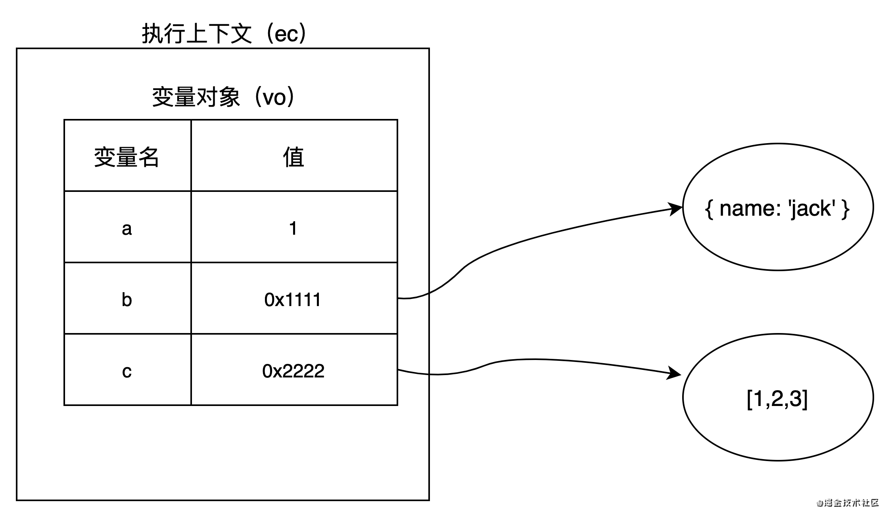
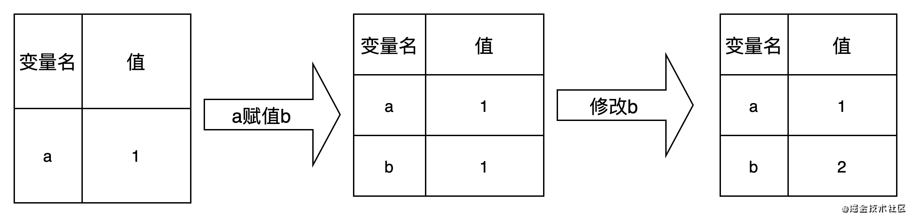
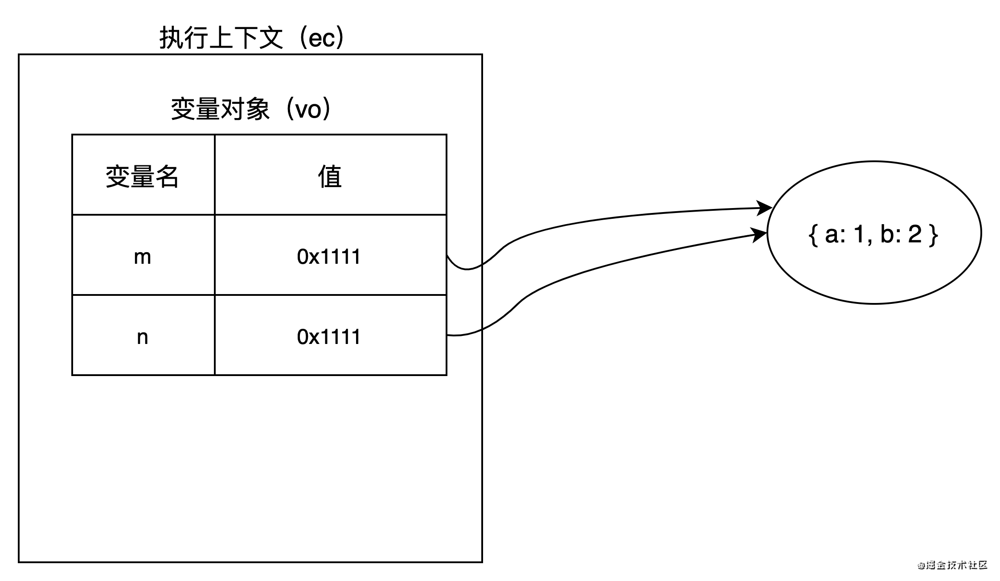

<!--  -->
<!--  -->


### 1.基本概念
- 什么是执行上下文？当函数在运行的时候，会创建一个执行环境，这个执行环境就叫执行上下文（execution context）.
- 数据是如何存储的？在执行上下文中会创建一个变量对象（variable object）,基础数据类型的变量名和值会保存在变量对象中，引用类型的值保存在堆中，变量对象中存储的是内存地址，内存地址指向堆中具体的值，我们可以通过操作对象的引用地址来操作对象.
- 基础数据类型和引用数据类型分类：基本数据类型有7种，分别是Undefined、Null、Boolean、Number、String、BigInt（es10新增）和Symbol（es6新增），引用数据类型有1种Object.

    1.1. 数据的存储，下面笔者通过demo和图来描述一下数据具体是如何存储的
    

```js
    function data () {
        var a = 1;
        var b = {
            name: 'jack'
        }
        var c = [1, 2, 3];
    }
    
    // 执行上下文
    let ExecutionContext = {
        // 变量对象
        VO: {
            a: 1,
            b: '0x1111',
            c: '0x2222'
        }
    }
```


<!--  -->
<!--  -->



  1.2. 数据的操作，基本数据类型赋值是值的拷贝，复制的是值本身；
  
```js
    var a = 1;
    var b = a;
    b = 2;
    console.log(a); // 1
    var ExecuteContext = {
        VO: { a: 1 }
    };

    ExecuteContext.VO.b = ExecuteContext.VO.a;
    ExecuteContext.VO.b = 2;
    console.log(ExecuteContext.VO.a); // 1
```

<!--  -->
<!--  -->


引用数据类型赋值，复制的是引用地址指针；

```js
    var m = { a: 1, b: 2 };
    var n = m;
    n.a = 10;
    console.log(m.a); // 10
    var ExecuteContext = {
        VO: { m: { a: 1, b: 2 } }
    };

    ExecuteContext.VO.n = ExecuteContext.VO.m;
    ExecuteContext.VO.n.a = 10;
    console.log(ExecuteContext.VO.m.a); // 10
```

<!--  -->
<!--  -->


### 2. 执行上下文的分类
- js代码在执行的时候会进入一个执行上下文，可以理解为当前代码的运行环境
- 在js中运行环境主要分为全局执行上下文环境和函数执行上下文环境
    
    - 全局执行上下文只有一个，在客户端中一般由浏览器创建，也就是我们熟悉的window对象，我们可以通过this直接访问到它。（window === this ?）
    - window对象同时也是var声明的全局变量的载体，我们通过var创建的全局变量，都可以通过window直接访问。
   
### 3. 执行上下文栈
- 在js执行过程中会产生多个执行上下文，js引擎会由栈来管理这些执行上下文
- 执行上下文栈也叫调用栈（call stack）,执行上下文栈用于存储代码执行期间创建的所有上下文，具有LIFO（Last in first out）后进先出，先进后出的特点
- 栈底永远是全局上下文（window）,栈顶为当前正在执行的上下文
- 当一个函数执行时会生成一个新的执行上下文并放入调用栈，执行完毕后会自动出栈


```js
    function one() {
    var a = 1;
    debugger;
    function two() {
        var b = 1;
        debugger;
        function three() {
            var c = 1;
            debugger;
        }
        three();
        debugger;
    }
    two();
    debugger;
}
one();
var globalExecuteContext = {
    VO: { setTimeout: 'setTimeout' }
}
var executeContextStack = [globalExecuteContext];
var oneExecuteContext = {
    VO: { a: 1 }
}
executeContextStack.push(oneExecuteContext);
var twoExecuteContext = {
    VO: { b: 2 }
}
executeContextStack.push(twoExecuteContext);
var threeExecuteContext = {
    VO: { c: 3 }
}
executeContextStack.push(threeExecuteContext);
console.log(executeContextStack);

executeContextStack.pop();
executeContextStack.pop();
executeContextStack.pop();
```

### 4. 执行上下文的生命周期
- 一个新的执行上下文的生命周期有两个阶段：创建阶段和执行阶段

    - 创建阶段
     
         - 创建变量对象
         - 确定作用域连
         - 确定this指向
    - 执行阶段
    
        - 变量赋值
        - 函数赋值
        - 代码执行
- 变量对象（VO）

    - 变量对象会保存变量声明(var)、函数参数(arguments)、函数定义(function)
    
        - 变量对象会首先获得函数的参数变量和值
        - 获取所有用`function`进行的函数声明，函数名为变量对象的属性名，值为函数对象,如果属性已经存在，值会用新值覆盖
        - 再依次将所有的var关键字进行变量声明，每找到一个变量声明，就会在变量对象上建一个属性，值为`undefined`,如果变量名已经存在，则会跳过，并不会修改原属性值,`let`声明的变量并不会在此阶段进行处理
        
- 活动对象（AO）

    - 在函数的调用栈中，如果当前执行上下文处于函数调用栈的顶端，则意味着当前上下文处于激活状态，那么此时变量对象称为活动对象（Activation Object）, 从VO(变量对象)转变成AO(活动对象)
    - 活动对象包含变量对象所有的属性，并且包含this指针
    
    
```js
function one(m) {
    function two() {
        console.log('two');
    }
}
one(1);

//执行阶段 VO=>AO
let VO = AO = {
    m:1,
    two: () => { console.log('two'); },

}

// 执行上下文
let oneEC={
    VO,
    this: window,
    // 作用域链
    scopeChain:[VO,globalVO] 
}
```
 

- 全局上下文的变量对象

    - 在浏览器里，全局对象为window
    - 全局上下文的变量对象为window，而且这个变量对象不能激活变成活动对象
    - 只要浏览器窗口打开，全局上下文会一直存在，所有的上下文都可以直接访问全局上下文变量对象上的属性
    - 只有全局上下文的变量对象允许通过VO的属性名称来间接访问，在函数上下文中是不能直接访问VO对象的
    - 未进入执行阶段前，变量对象中的属性都不能访问，但是进入到执行阶段之后，变量对象转变成了活动对象，里面的属性就都能被访问了，对于函数上下文来讲，活动对象和变量对象其实都是同一个对象，只是处于执行上下文的不同生命周期
----