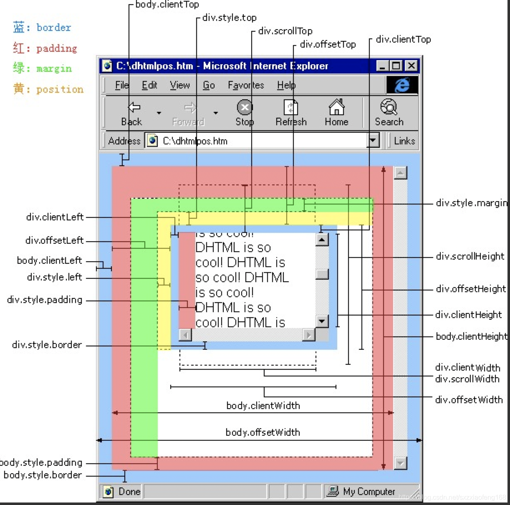

先上图，俗话说的好：一图顶千言。图片可以清楚直观的看到每个属性各自代表的偏移量位置。

<!--  -->
<!--  -->

### 1.offset
假设 obj 为某个 HTML 控件。

 1. obj.offsetTop：指obj相对于版面或由 offsetParent 属性指定的父坐标的计算上侧位置，单位：像素。
offsetTop = offsetParent的padding - top + 中间元素的offsetHeight + 当前元素的margin - top

2. obj.offsetLeft：指obj相对于版面或由 offsetParent 属性指定的父坐标的计算左侧位置，单位：像素。
offsetLeft = offsetParent的padding - left + 中间元素的offsetWidth + 当前元素的margin - left

3. obj.offsetWidth：指obj控件自身的绝对宽度，不包括因 overflow 而未显示的部分，也就是其实际占据的宽度，单位：像素。
offsetWidth = border - width * 2 + padding - left + width + padding - right

4. obj.offsetHeight：指obj控件自身的绝对高度，不包括因 overflow 而未显示的部分，也就是其实际占据的高度，单位：像素。
offsetHeight = border - width * 2 + padding - top + height + padding - bottom

下面我们对前面提到的 offsetParent 作个说明：
*	offsetParent 会获取定义对象 offsetTop 和 offsetLeft 属性的容器对象的引用。
	* 	如果当前元素的父级元素中没有进行CSS定位（position为 absolute/relative），offsetParent 为 body
	*	 如果当前元素的父级元素中有CSS定位（ position 为 absolute/relative），offsetParent 取父级中最近的元素
		
*	offsetTop 与 offsetParent 很复杂，不同浏览器有不同解释，浮动一下解释又不同了，所以我们一般只要理解通过二者可以获得控件在浏览器中的绝对位置即可。以上属性在 FireFox 中也有效。另外：我们这里所说的是指 HTML 控件的属性值，并不是 document.body，document.body 的值在不同浏览器中有不同解释（实际上大多数环境是由于对 document.body 解释不同造成的，并不是由于对 offset 解释不同造成的）

*	我们知道 offsetTop 可以获得 HTML 元素距离上方或外层元素的位置，style.top 也是可以的，二者的区别是：
一、offsetTop 返回的是数字，而 style.top 返回的是字符串，除了数字外还带有单位：px。
二、offsetTop 只读，而 style.top 可读写。
三、如果没有给 HTML 元素指定过 top 样式，则 style.top 返回的是空字符串。
offsetLeft 与 style.left、offsetWidth 与 style.width、offsetHeight 与 style.height 也是同样道理。

### 2. scroll

scroll指滚动，包括这个元素没显示出来的实际宽度，包括 padding，不包括滚动条、 border
1. scrollHeight 获取对象的滚动高度，对象的实际高度；
2. scrollLeft 设置或获取位于对象左边界和窗口中目前可见内容的最左端之间的距离
3. scrollTop 设置或获取位于对象最顶端和窗口中可见内容的最顶端之间的距离
4. scrollWidth 获取对象的滚动宽度

- scrollHeight
IE、Opera 认为 scrollHeight 是网页内容实际高度，可以小于 clientHeight。NS（Netscape）、FF（FireFox）认为 scrollHeight是网页内容高度，不过最小值是 clientHeight。简单地说，clientHeight 就是透过浏览器看内容的这个区域高度。NS、FF 认为 offsetHeight 和 scrollHeight 都是网页内容高度，只不过当网页内容高度小于等于 clientHeight 时，scrollHeight 的值是 clientHeight，而 offsetHeight 可以小于 clientHeight。IE、Opera 认为 offsetHeight 是可视区域 clientHeight 滚动条加边框。scrollHeight 则是网页内容实际高度。同理clientWidth、offsetWidth 和 scrollWidth 的解释与上面相同，只是把高度换成宽度即可。

- scrollLeft, scrollTop:
如果元素是可以滚动的,可以通过这俩个属性得到元素在水平和垂直方向上滚动了多远,单位是象素.
对于不可以滚动的元素,这些值总是0.

- scrollHeight, scrollWidth:
不管有多少对象在页面上可见,他们得到的是整体.

### 3. client

client指元素本身的可视内容，不包括 overflow被折叠起来的部分，不包括滚动条、 border，包括 padding
1. clientWidth 对象可见的宽度，不包括滚动条等边线，会随窗口的显示大小改变
2. clientHeight 对象可见的高度
3. clientTop、clientLeft 这两个返回的是元素周围边框的厚度，一般它的值就是0。因为滚动条不会出现在顶部或者左侧

- 1.clientHeight, clientWidth:
这两个属性大体上显示了元素内容的象素高度和宽度.理论上说这些测量不考虑任何通过样式表加入
元素中的页边距,边框等.

- 2.clientLeft, clientTop:
这两个返回的是元素周围边框的厚度,如果不指定一个边框或者不定位改变元素,他的值就是0.

- 3.style.left:
定位元素与包含它的矩形左边界的偏移量

- 4.style.pixelLeft:
返回定位元素左边界偏移量的整数像素值.因为属性的非像素值返回的是包含单位的字符串,例如,30px. 利用这个属性可以单独处理以像素为单位的数值.

- 5.style.posLeft:
返回定位元素左边界偏移量的数量值,不管相应的样式表元素指定什么单位.因为属性的非位置值返回的是包含单位的字符串,例如,1.2em

- left: 为从左向右移的位置,即控件距离屏幕左边缘的距离;
clientLeft: 返回对象的offsetLeft属性值和到当前窗口左边的真实值之间的距离
offsetLeft: 返回对象相对于父级对象的布局或坐标的left值，就是以父级对象左上角为坐标原点，向右和向下为X、Y轴正方向的x坐标
pixelLeft: 设置或返回对象相对于窗口左边的位置
scrollWidth: 是对象的实际内容的宽，不包边线宽度，会随对象中内容的多少改变（内容多了可能会改变对象的实际宽度）。
clientWidth: 是对象可见的宽度，不包含滚动条等边线，会随窗口的显示大小改变。
offsetWidth: 是对象的可见宽度，包含滚动条等边线，会随窗口的显示大小改变。

IE6.0、FF1.06+：
clientWidth = width + padding
clientHeight = height + padding
offsetWidth = width + padding + border
offsetHeight = height + padding + border

IE5.0/5.5：
clientWidth = width - border
clientHeight = height - border
offsetWidth = width
offsetHeight = height

(需要提一下：CSS中的margin属性，与clientWidth、offsetWidth、clientHeight、offsetHeight均无关)
offsetwidth: 是元素相对父元素的偏移宽度。等于border + padding + width
clientwidth：是元素的可见宽度。等于padding + width
scrollwidth: 是元素的宽度且包括滚动部分。
offsetLeft:  Html元素相对于自己的offsetParent元素的位置
scrollLeft:  返回和设置当前横向滚动条的坐标值