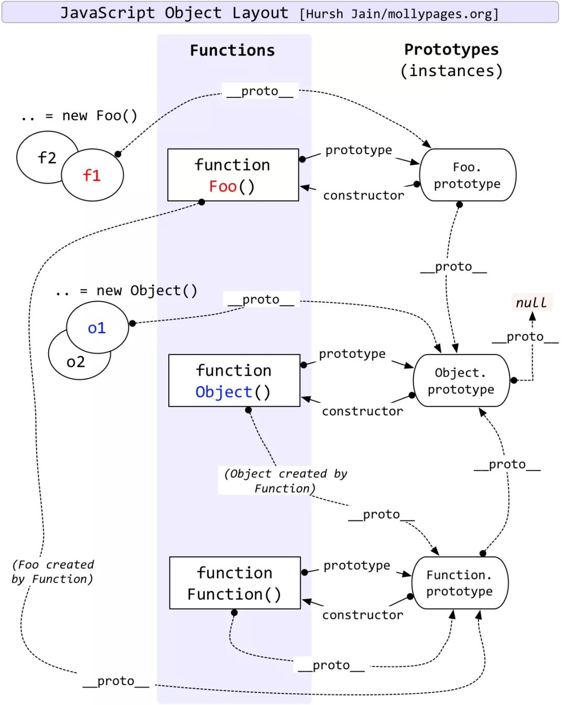

1.**原型**是什么?
- 原型指的是原型属性:
prototype: 所有函数都有prototype属性, prototype属性的值是对象。这个对象叫**原型对象**。(显示原型)

- 这个原型对象上默认有两个属性:
    * **constructor**: 指向函数本身
    * __proto__: 指向Object.prototype(大写的Object原型对象)
    * __proto__(隐式原型):所有实例对象都有__ proto__ 属性，它的值的是对象。值为它对应构造函数. prototype的值(所有对象都是实例对象, 本质都是new出来的)

	- 1.每个函数function都有一个prototype, 即显式原型
	- 2.每个实例对象都有一个__proto__ ， 可称为隐式原型
	- 3.对象的隐式原型的值为其对应构造函数的显式原型的值
- **总结:**
	* 函数的prototype属性: 在定义函数时自动添加的，默认值是一个对象
	* 对象的__proto__ 属性: 创建对象时自动添加的， 默认值为构造函数的prototype属	性值
	* 程序员能直接操作显式原型，但不能直接操作隐式原型(ES6之前)

**原型链别名**: 隐式原型链
* 作用: 查找对象的属性(或方法)
* 对象查找属性的规则会沿着原型链查找

	1.**读取**对象的属性值时: 会**自动到原型链**中查找
	2.设置对象的属性值时:不会查找原型链，如果当前对象中没有此属性，直接添加此属性并设置其值
	3.方法一般定义在原型中，属性一般通过构造函数定义在对象本身上

**总结:**
- 1.所有函数都有显示原型属性prototype(也叫原型对象)(prototype原型对象有两个默认属性)
        constructor: 指向函数本身
        __proto__(因为它是对象，所以有隐式原型属性。因为这个对象不是你new的，所以构造函数是Object) Object. prototype

- 2.所有对象都有隐式原型属性__proto__
    (所有对象都是实例对象)

- 3.对象的隐式原型属性的值指向对应的构造函数的显示原型属性的值(原型对象)

- 4.你new出来实例对象， 构造函数就是你new的那个函数。
不是你new出来的实例对象，默认就是new Object产生的，所以构造函数就是Object

- 5.`Object.prototype.__proto__ === null` 是原型链的尽头

- 6.所有函数都是new Function产生的, 包括大写Function它本身 
--> `Function.__proto__ === Function.prototype`

**原型链图解**
<!--  -->
